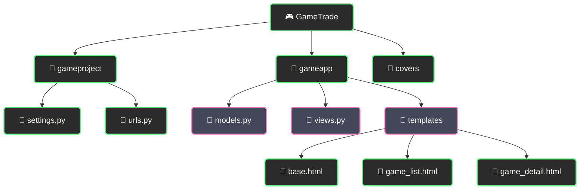

# 🎮 GameTrade - Торговая площадка игровых предметов

  
  
  

  
  
  

<!-- ⚔️ ДЕКОРАТИВНЫЙ РАЗДЕЛИТЕЛЬ ⚔️ -->

  

## 🛒 Безопасная торговля игровыми предметами и аккаунтами

## 📋 О проекте

<h3><i>Покупай и продавай игровые ценности безопасно!</i></h3>

GameTrade - это современная торговая площадка для покупки и продажи внутриигровых предметов, валюты и аккаунтов. Построенная на Django и PostgreSQL, платформа обеспечивает безопасные транзакции между игроками, защиту от мошенничества и удобный пользовательский интерфейс.

<!-- 🎯 ДЕКОРАТИВНЫЙ РАЗДЕЛИТЕЛЬ 🎯 -->

  

### ✨ Основные возможности

<table style="min-width: 300px; width: auto; max-width: 100%; overflow-x: auto; display: block;">
  <tr>
    <th align="center">🎮 Функция</th>
    <th align="center">📝 Описание</th>
  </tr>
  <tr>
    <td align="center"><b>🛍️ Торговая площадка</b></td>
    <td>Удобный каталог предложений с расширенными фильтрами</td>
  </tr>
  <tr>
    <td align="center"><b>🔐 Безопасные сделки</b></td>
    <td>Защита покупателей и продавцов с гарантией возврата средств</td>
  </tr>
  <tr>
    <td align="center"><b>💬 Чат между пользователями</b></td>
    <td>Обсуждение деталей сделки в режиме реального времени</td>
  </tr>
  <tr>
    <td align="center"><b>⭐ Рейтинговая система</b></td>
    <td>Оценка продавцов и покупателей для повышения доверия</td>
  </tr>
  <tr>
    <td align="center"><b>🔍 Умный поиск</b></td>
    <td>Быстрый поиск предметов по играм, серверам и характеристикам</td>
  </tr>
  <tr>
    <td align="center"><b>📊 Статистика профиля</b></td>
    <td>Отслеживание истории сделок и репутации на платформе</td>
  </tr>
</table>

<!-- 🔥 ДЕКОРАТИВНЫЙ РАЗДЕЛИТЕЛЬ 🔥 -->

  

## 🚀 Технологический стек

<b>⚡ Используемые технологии</b>

 

| 💻 Технология | 📝 Описание |
|---------------|-------------|
| Django 5.0 | Мощный Python-фреймворк для веб-разработки |
| PostgreSQL | Надёжная реляционная база данных |
| Bootstrap 5 | Современный CSS-фреймворк для адаптивного дизайна |
| Docker | Контейнеризация для удобного развёртывания |
| Pillow | Обработка изображений для обложек игр и предметов |
| Font Awesome | Иконки для улучшения пользовательского интерфейса |
| Django ORM | Удобная работа с базой данных через объектную модель |
| Docker Compose | Оркестрация контейнеров для разработки и продакшена |

<!-- 🎮 ДЕКОРАТИВНЫЙ РАЗДЕЛИТЕЛЬ 🎮 -->

  

## 🎯 Для геймеров

<kbd>

</kbd>

  

<table style="min-width: 300px; width: auto; max-width: 100%; overflow-x: auto; display: block;">
  <tr>
    <th align="center">👥 Кому пригодится</th>
    <th align="center">📝 Преимущества</th>
  </tr>
  <tr>
    <td align="center">👨‍🎮 Хардкорные геймеры</td>
    <td>Доступ к редким игровым предметам и валюте</td>
  </tr>
  <tr>
    <td align="center">👩‍🎮 Коллекционеры</td>
    <td>Поиск уникальных предметов для своей коллекции</td>
  </tr>
  <tr>
    <td align="center">💰 Торговцы</td>
    <td>Заработок на перепродаже ценных игровых активов</td>
  </tr>
  <tr>
    <td align="center">🕹️ Киберспортсмены</td>
    <td>Быстрое приобретение необходимого инвентаря</td>
  </tr>
</table>

<!-- 💎 ДЕКОРАТИВНЫЙ РАЗДЕЛИТЕЛЬ 💎 -->

  

## ⚙️ Установка

### Системные требования

<table style="min-width: 300px; width: auto; max-width: 100%; overflow-x: auto; display: block;">
  <tr>
    <th align="center">🖥️ Требование</th>
    <th align="center">⚙️ Минимум</th>
    <th align="center">🚀 Рекомендуется</th>
  </tr>
  <tr>
    <td align="center">Python</td>
    <td align="center">3.8</td>
    <td align="center">3.10</td>
  </tr>
  <tr>
    <td align="center">PostgreSQL</td>
    <td align="center">11</td>
    <td align="center">13</td>
  </tr>
  <tr>
    <td align="center">Docker</td>
    <td align="center">20.10</td>
    <td align="center">23.0</td>
  </tr>
</table>

### Пошаговая установка

<table style="min-width: 300px; width: auto; max-width: 100%; overflow-x: auto; display: block;">
  <tr>
    <th colspan="2" align="center">🚀 Установка проекта</th>
  </tr>
  <tr>
    <td align="center" width="70"><b>1️⃣</b></td>
    <td>
      <b>Клонируйте репозиторий</b> 
      <code>git clone https://github.com/yourusername/gametrade.git</code> 
      <code>cd gametrade</code>
    </td>
  </tr>
  <tr>
    <td align="center"><b>2️⃣</b></td>
    <td>
      <b>Запустите с помощью Docker Compose</b> 
      <code>docker-compose up -d</code>
    </td>
  </tr>
  <tr>
    <td align="center"><b>3️⃣</b></td>
    <td>
      <b>Создайте суперпользователя</b> 
      <code>docker-compose exec web python manage.py createsuperuser</code>
    </td>
  </tr>
  <tr>
    <td align="center"><b>4️⃣</b></td>
    <td>
      <b>Откройте сайт</b> 
      Перейдите по адресу <code>http://localhost:8000</code>
    </td>
  </tr>
</table>

<!-- 🛡️ ДЕКОРАТИВНЫЙ РАЗДЕЛИТЕЛЬ 🛡️ -->

  

## 🔧 Разработка

### Структура проекта

### Сборка и тестирование

<table style="min-width: 300px; width: auto; max-width: 100%; overflow-x: auto; display: block;">
  <tr>
    <th align="center">🛠️ Действие</th>
    <th align="center">💻 Команда</th>
  </tr>
  <tr>
    <td align="center">Запуск разработки</td>
    <td><code>docker-compose up</code></td>
  </tr>
  <tr>
    <td align="center">Запуск миграций</td>
    <td><code>docker-compose exec web python manage.py migrate</code></td>
  </tr>
  <tr>
    <td align="center">Сборка статики</td>
    <td><code>docker-compose exec web python manage.py collectstatic</code></td>
  </tr>
  <tr>
    <td align="center">Запуск тестов</td>
    <td><code>docker-compose exec web python manage.py test</code></td>
  </tr>
</table>

<!-- 🏆 ДЕКОРАТИВНЫЙ РАЗДЕЛИТЕЛЬ 🏆 -->

  

## 📧 Контакты

<table style="min-width: 300px; width: auto; max-width: 100%; overflow-x: auto; display: block;">
  <tr>
    <th align="center">📱 Контакт</th>
    <th align="center">🔗 Ссылка</th>
  </tr>
  <tr>
    <td align="center">📧 Email</td>
    <td align="center"><a href="mailto:reazonvan206@gmail.com">reazonvan206@gmail.com</a></td>
  </tr>
  <tr>
    <td align="center">💬 Telegram</td>
    <td align="center"><a href="https://t.me/reazonvan">@reazonvan</a></td>
  </tr>
  <tr>
    <td align="center">🌐 GitHub</td>
    <td align="center"><a href="https://github.com/ReazonVan">ReazonVan</a></td>
  </tr>
</table>

<!-- 🌟 ДЕКОРАТИВНЫЙ РАЗДЕЛИТЕЛЬ 🌟 -->

  

## 🤝 Поддержка проекта

<kbd>

</kbd>

---

  
<h1>🎮 GameTrade - Торговая площадка для настоящих геймеров! 🎮</h1>

